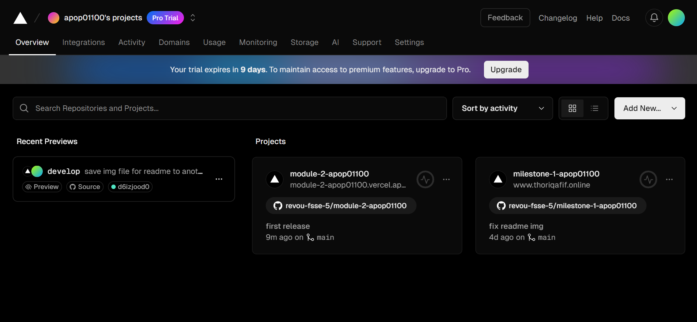
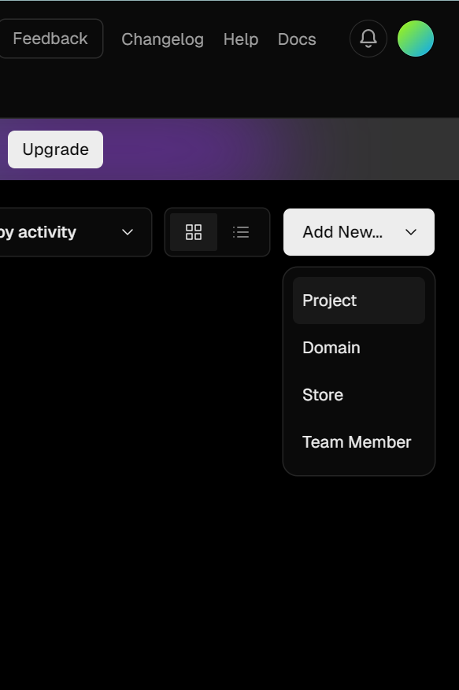
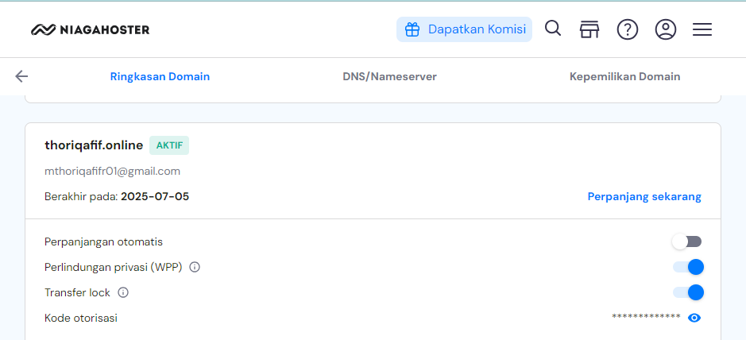
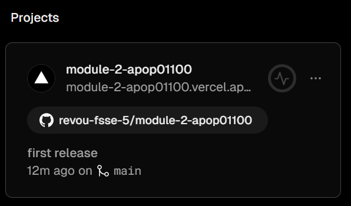
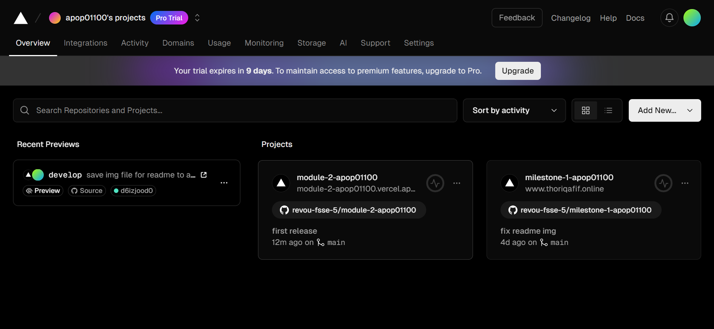
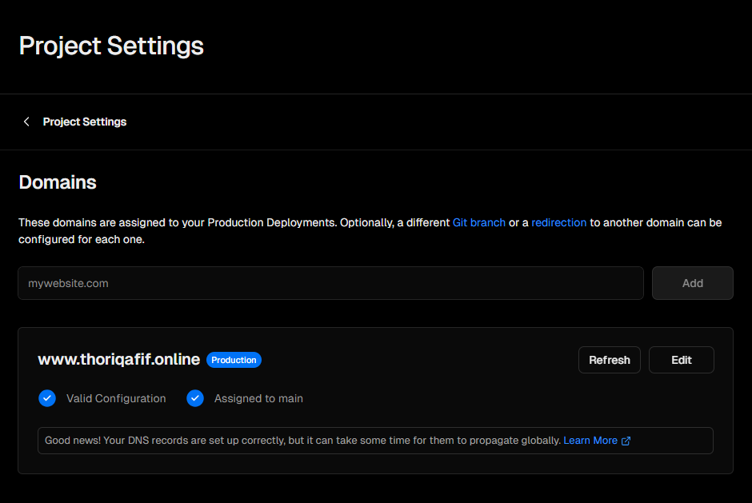
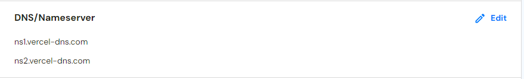
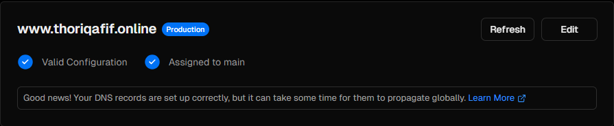
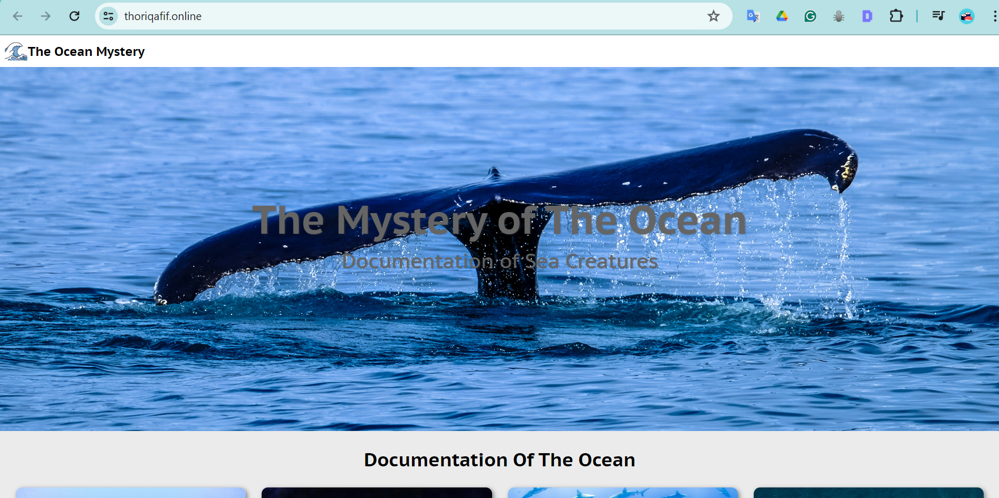

## DEPLOYMENT
The project has been successfully deployed using Vercel. You can access the production version of the website by visit this link: https://www.thoriqafif.online/. Step-by-step to deploy the project to Vercel and using customize domain: 

1. Connect your account to Vercel

    The first step to deploy this project in Vercel is createing a new account or use existing account. As a beginner programmer, I would prefer using GitHub account instead. 

    After you successfully login, you wil be redirected to dashboard of Vercel app like this:

    
    In thise case, I already import the project from GitHub to Vercel. So if you want to import your existing project from GitHub, you can "Add New Project" like this:

    

    And then import your GitHub repository in here:

    

2. Domain Register with NiagaHoster
    
    Go to https://niagahoster.co.id and log in or create a new account. Check available domain that you wanted and make it yours.

    After you login and have a domain for your project, you will be redirected to this pages:

    

3. Modify your project with customize domain
    
    Go to dashboard Vercel -> Choose The Project -> Domain :

    Dashoboard Verchel
   
    

    The Project
   
    

    Select Domain
   
    

    Import your customize domain, and make sure DNS/Nameserver in NiagaHoster same in Vercel. You can setting DNS/Nameserver Niagahoster in same page Niagahoster domain above:
    

5. Congartulaitons, Your's done!

    You should wait within 1x24 hours to let the NiagaHoster setting up the DNS, it could be faster or slower depending on the provider internet that you're using. If you success in this step, the output will be  like this in your Vercel project domain:
    

    And this looks like the project with new domain:

    
